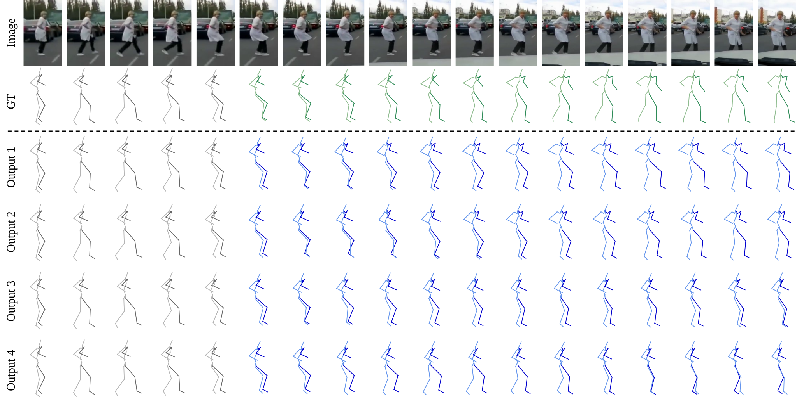
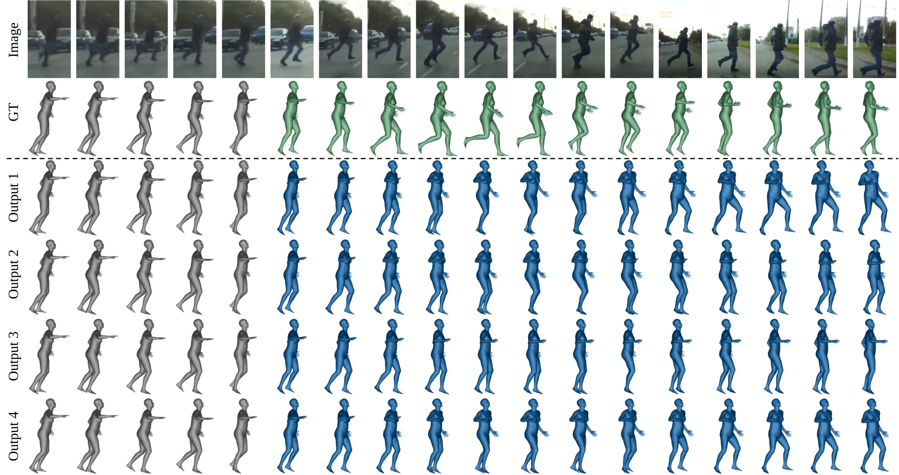

# PVCPM
Scene Semantics-Guided Probabilistic Pedestrian Pre-Collision Motion Prediction

简体中文 | [English](README.md)

## **Abstract**

预碰撞运动预测旨在预判行人在车辆即将发生碰撞风险下的应急姿态，以及后续的运动演变过程。该任务存在极强的被动性与不确定性，且和复杂交通场景深度耦合。现有人体运动预测方法生成的无约束多样化预测结果，往往与真实碰撞场景相悖。
针对上述问题，本文构建了 PVCPM 数据集 —— 一套专为交通场景设计的行人预碰撞运动预测数据集。同时，我们借助离散余弦变换（DCT）对该数据集的运动特征展开分析，结果表明 PVCPM 与传统日常人体运动数据集存在显著高频特征差异。
此外，本文提出一种基于两阶段条件变分自编码器（CVAE）、由场景语义引导的概率化运动预测框架。该框架将运动生成与多样化采样解耦，并引入视觉语言模型（VLM）提取场景语义特征；通过特征线性调制（FiLM）机制，利用语义特征对运动序列进行调控。
本研究同时兼顾行人预碰撞运动独有的动力学特征与真实交通语义环境，能够生成多样化且贴合现实交通场景的预测结果。在 PVCPM 数据集上开展的大量对比实验证明，所提方法相较于主流基线模型及同期前沿算法具备优越性能，验证了该框架用于行人预碰撞概率运动预测的有效性。


---

## **环境配置**

我们的代码和环境和继承自 [DivSamp](https://github.com/Droliven/diverse_sampling) 项目，您也可以根据该项目配置环境。环境配置`python 3.12`; `PyTorch 2.10.0+cu128`; `requirements.txt`

```python
conda create -n PVCPM_env python=3.12
conda activate PVCPM_env

pip install torch==2.10.0 torchvision==0.25.0 torchaudio==2.10.0 --index-url https://download.pytorch.org/whl/cu128
pip install -r requirements.txt
```

## 数据下载

- 从以下链接下载数据集`dataset`和训练权重`ckpt` 文件夹：[PVCPM](https://pan.baidu.com/s/1rj1tCMJoHYd1WTo3B6dJUg?pwd=2iha)
- 使用以下命令下载Qwen3.5-9B：

```python
huggingface-cli download --resume-download Qwen/Qwen3.5-9B --local-dir vlm_model/Qwen/Qwen3.5-9B
```

<details>
<summary><strong>📂 项目目录结构</strong>（点击展开/收起）</summary>

```python
PVCPM
├── dataset
│   └── pvcp
│       ├── data_3d_pvcp_video_m35.npz
│       ├── pvcp_scene_splits_8_2.json
│       ├── data_3d_pvcp_video_m35_Qwen3.5-9B_ped_pose_ego_vehicle_hist10_d512.rfeat.audit.jsonl
│       ├── data_3d_pvcp_video_m35_Qwen3.5-9B_ped_pose_ego_vehicle_hist10_d512.rfeat.npz
│       ├── build_qwen_ped_pose_features_10.py
│       ├── frame
│       └── SMPLX_models
│           ├── SMPL_NEUTRAL.npz
│           └── SMPLX_NEUTRAL.npz
├── vlm_model
│   └── Qwen
│       └── Qwen3.5-9B
├── ckpt
│   ├── pvcp_video_t1
│   └── pvcp_video_t2
├── pvcp_video
│   ├── configs
│   ├── datas
│   ├── nets
│   ├── runs
│   └── inference.py
├── main.py
├── run_main.sh
├── run_main_t1.sh
├── run_main_t2.sh
├── run_inference_vis_pvcp_video.sh
├── requirement.txt
├── assets
└── README.md
```

</details>
    

## 训练与评估

```python
CUDA_VISIBLE_DEVICES=0 SEED=44 bash run_main.sh # Stage-1  +  Stage-2
```

or

```python
CUDA_VISIBLE_DEVICES=0 SEED=44 bash run_main_t1.sh # Stage-1

CUDA_VISIBLE_DEVICES=0 SEED=44 STAGE1_CKPT_NAME=pvcp_video_t1  bash run_main_t2.sh # Stage-2
```

or

```python
python main.py --exp_name=pvcp_video_t1 --is_train=1 --seed=44

python main.py --exp_name=pvcp_video_t2 --is_train=1 --seed=44 \
                --model_path_t1="ckpt/pvcp_video_t1/models/pvcp_video_t1_best.pth"

python main.py --exp_name=pvcp_video_t2 --is_load=1 --seed=44 \
                --model_path="ckpt/pvcp_video_t2/models/pvcp_video_t2_best.pth"
```

## 推理与可视化

首先按照[**AMASS-skeleton-to-SMPL**](https://github.com/Ceveloper/AMASS-skeleton-to-SMPL)配置，将其与PVCPM放置于同一文件夹下。

```python
CUDA_VISIBLE_DEVICES=0 SORT_PREDICTIONS_BY_GT=1 SEED=44 bash run_inference_vis_pvcp_video.sh
```






📣 我们的论文正在评审中...
